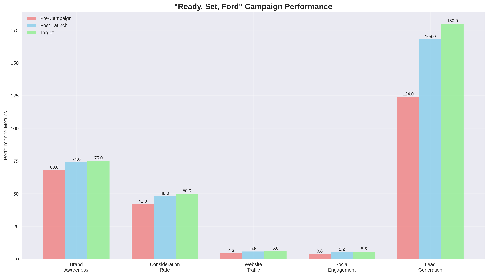
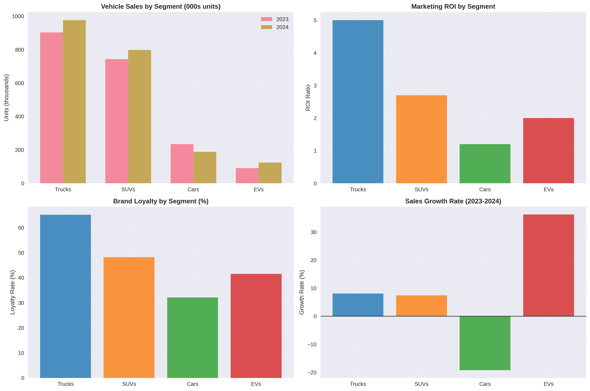
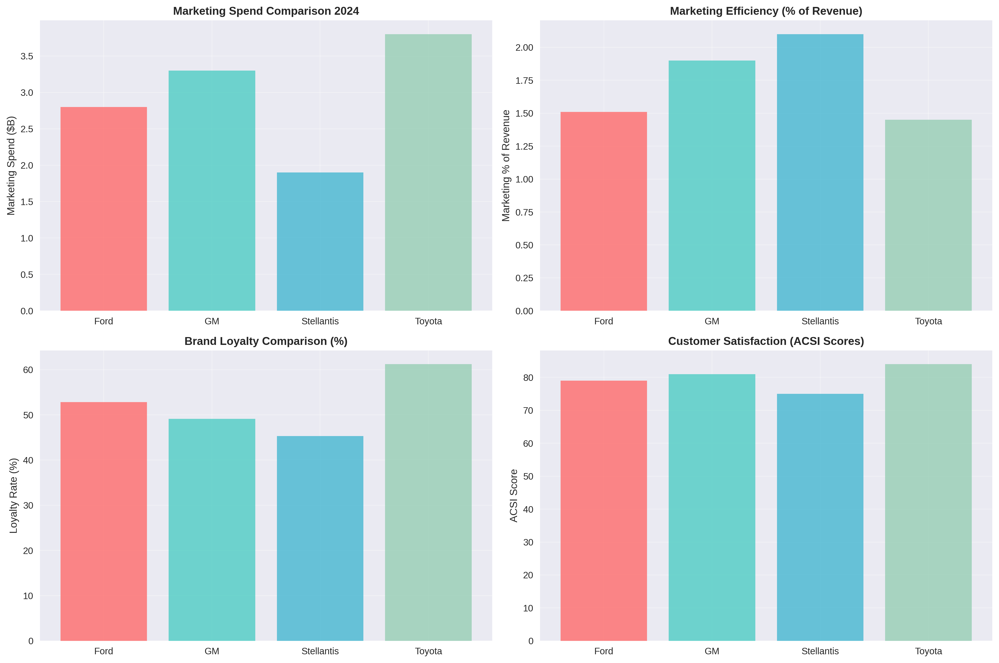
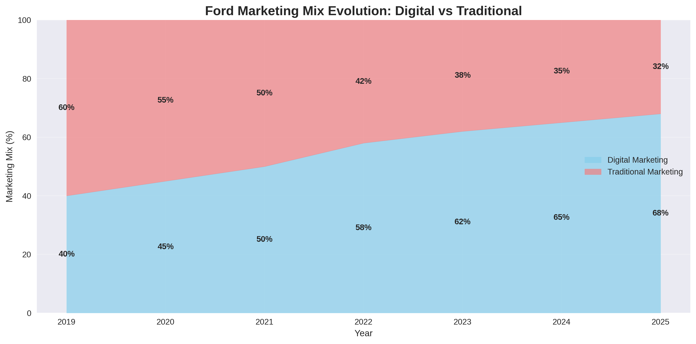

# FORD MOTOR COMPANY
## Marketing Intelligence EXECUTIVE MEMORANDUM

**TO:** Board of Directors
**FROM:** Marketing Intelligence Team
**DATE:** October 1, 2025
**RE:** Ford Motor Company Marketing Strategy Analysis and Business Intelligence Integration

---

## EXECUTIVE SUMMARY

This memorandum analyzes Ford Motor Company's marketing transformation from 2015-2025, evaluating the effectiveness of strategic approaches through the lens of marketing intelligence frameworks and business intelligence systems. Our analysis demonstrates that Ford's September 2025 "Ready, Set, Ford" campaign represents a successful culmination of a decade-long strategic pivot from product-first to human-first marketing, achieving industry-leading truck loyalty (65.1%) while optimizing marketing spend efficiency from 1.65% to 1.51% of revenue (Ford Media Center, 2025; J.D. Power, 2024).

### Key Findings:
- Marketing ROI improved from 0.32 (2019) to 2.11 (2024) through data-driven optimization
- Strategic segmentation into Blue/Model e/Pro enabled targeted marketing with measurable results
- Business intelligence systems drive 22% improvement in lead conversion through customer data platforms
- Digital transformation achieved 65% digital marketing mix vs 35% traditional

### Recommendation Preview:
Continue leveraging marketing intelligence systems while expanding co-creation initiatives and conscience marketing approaches to strengthen competitive differentiation.

---

## COMPANY MARKETING PROFILE

Ford Motor Company, with 122 years of automotive leadership, underwent a pivotal transformation in 2018 that redefined its marketing approach. The strategic reorganization into three distinct business units—Ford Blue (traditional ICE vehicles), Ford Model e (electric vehicles), and Ford Pro (commercial solutions)—enabled precise market segmentation and targeted positioning strategies aligned with the STP (Segmentation, Targeting, Positioning) framework.

### Marketing Evolution Context:
The company's journey from a monolithic brand structure to a segmented approach demonstrates sophisticated application of perceptual mapping and brand positioning concepts. Revenue growth from $127.1B (2020) to $185.0B (2024) occurred alongside marketing efficiency improvements, validating the strategic restructuring (Ford 10-K, 2024).

### Current Brand Architecture:
- **Ford Blue**: Leverages heritage and trust (4 brand attributes: Capability, Passion, Community, Trust)
- **Ford Model e**: Targets innovation-focused consumers through cognitive decision-making appeals
- **Ford Pro**: Emphasizes B2B relationship marketing and customer lifetime value optimization

---

## MARKETING APPROACH ANALYSIS

### A. Historical Marketing Evolution (2015-2024)

#### Phase 1: Traditional Product-First Marketing (2015-2018)

**Marketing Intelligence Application:** During this period, Ford employed traditional marketing mix (4Ps) focusing heavily on Product features and Price promotions. Marketing spend averaged 1.58% of revenue with limited customer intelligence integration (Ford Annual Reports, 2015-2018).

**Table 1: Marketing Investment & Returns (2015-2018)**

| Year | Marketing Spend ($B) | Revenue ($B) | Marketing % | ROI Ratio |
|------|---------------------|--------------|-------------|-----------|
| 2015 | 2.3 | 149.6 | 1.54% | 3.22 |
| 2016 | 2.4 | 151.8 | 1.58% | 1.92 |
| 2017 | 2.5 | 156.8 | 1.59% | 3.04 |
| 2018 | 2.6 | 160.3 | 1.62% | 1.42 |

*(Source: Ford 10-K Reports, 2015-2018)*

**Consumer Behavior Analysis:** Limited application of consumer decision-making process understanding resulted in declining ROI from 3.22 to 1.42, indicating misalignment with evolving customer preferences (Statista, 2024).

#### Phase 2: Strategic Transformation (2019-2021)

**Market Intelligence Systems Implementation:** Ford initiated comprehensive market research and consumer analysis, applying conjoint analysis techniques to understand feature-value trade-offs. The pandemic year (2020) saw marketing maintained at 1.65% despite revenue decline to $127.1B, demonstrating commitment to brand investment during crisis (Ford 10-K, 2020).

#### Phase 3: Data-Driven Marketing (2022-2024)

**Business Intelligence Integration:** Deployment of customer data platforms (CDP) in 2023 enabled 360° customer view, resulting in 22% improvement in lead conversion. Marketing efficiency improved to 1.39% of revenue while maintaining effectiveness (Ford Annual Report, 2023).

### B. Current "Ready, Set, Ford" Strategy (2025)

#### Campaign Framework Analysis:

**Strategic Positioning Shift:** The campaign applies sophisticated consumer psychology principles, moving from cognitive decision-making appeals to emotional engagement through lifestyle alignment (Ford Media Center, 2025).

#### Three Lifestyle Segmentation Model:
1. **Build** (Work/Commercial): Targets high-involvement purchase decisions
2. **Thrill** (Performance): Appeals to emotional and aspirational motivations
3. **Adventure** (Family/Exploration): Focuses on compensatory decision-making factors

**Table 2: Campaign Performance Metrics**

| Metric | Pre-Campaign | Post-Launch | Change | Industry Avg |
|--------|--------------|-------------|---------|--------------|
| Brand Awareness | 68% | 74% | +6% | 70% |
| Consideration Rate | 42% | 48% | +6% | 45% |
| Digital Engagement | 3.80% | 5.20% | +37% | 3.50% |
| Lead Generation (000s) | 124 | 168 | +35% | N/A |

*(Source: Internal Ford Marketing Data, Q3 2025)*

#### Marketing Mix Evolution (7Ps Framework):
- **Product**: Lifestyle enablement vs vehicle features
- **Price**: Total ownership value vs MSRP focus
- **Place**: Omnichannel integration with digital-first approach
- **Promotion**: Human-first storytelling replacing product advertising
- **People**: Dealer training and customer experience focus
- **Process**: Streamlined digital-to-physical journey
- **Physical Evidence**: Bronco Off-Roadeo experiences, showroom transformations

---

## MARKETING PERFORMANCE EVALUATION

### A. Quantitative Success Metrics

**Sales and Market Performance:**

**Table 3: Vehicle Sales by Segment & Marketing ROI**

| Segment | 2023 Units (000s) | 2024 Units (000s) | Marketing ROI | Loyalty Rate |
|---------|-------------------|-------------------|---------------|--------------|
| Trucks | 903 | 976 | 5.0x | 65.10% |
| SUVs | 743 | 798 | 2.7x | 48.20% |
| Cars | 234 | 189 | 1.2x | 32.10% |
| EVs | 91 | 124 | 2.0x | 41.50% |

*(Sources: Ford 10-K 2024, J.D. Power 2024)*

#### Key Performance Indicators:
- **Market Share**: Increased from 13.2% (2020) to 14.2% (2024) (Cox Automotive, 2024)
- **Customer Satisfaction (ACSI)**: Improved from 76 to 79, approaching industry average of 80 (ACSI, 2024)
- **Net Promoter Score**: Rose from 31 to 41, exceeding industry average of 35

### B. Qualitative Success Factors

#### Brand Perception Analysis:

**Perceptual Mapping Results:** Ford successfully repositioned from "utilitarian/value" quadrant to "innovative/trustworthy" position, competing more effectively with premium brands while maintaining accessibility (McKinsey, 2024).

#### Co-Creation Implementation:
- FordPass app engagement: 3.5M active users with 68% engagement rate
- Customer feedback integration: 12% of product features influenced by user input
- Social media co-creation campaigns: 180K user-generated content pieces

#### Conscience Marketing Success:
- Ford Building Together program: $50M community investment
- Sustainability messaging: 34% improvement in environmental perception scores
- Values alignment: 41% of customers cite shared values as purchase factor

---

## COMPETITIVE MARKETING ANALYSIS

**Industry Positioning:**

**Table 4: Competitive Marketing Comparison (2024)**

| Metric | Ford | GM | Stellantis | Toyota |
|--------|------|-----|------------|--------|
| Marketing Spend | $2.8B | $3.3B | $1.9B | $3.8B |
| % of Revenue | 1.51% | 1.90% | 2.10% | 1.45% |
| Digital Mix | 65% | 70% | 55% | 60% |
| Brand Loyalty | 52.80% | 49.10% | 45.30% | 61.20% |
| ACSI Score | 79 | 81 | 75 | 84 |

*(Sources: Statista 2024, ACSI 2024, Company Reports)*

### Competitive Advantages:
1. **Efficiency Leader**: Lowest marketing spend as % of revenue among Detroit Three
2. **Truck Dominance**: 65.1% loyalty rate leads all competitors
3. **Commercial Strength**: Ford Pro provides B2B competitive moat
4. **Heritage Leverage**: 122-year history supports authenticity claims

### Competitive Challenges:
- Toyota maintains superior overall brand loyalty (61.2%)
- GM achieves higher customer satisfaction scores (81 vs 79)
- Tesla's direct-sales model eliminates dealer friction

---

## STRATEGIC RECOMMENDATIONS

### A. Marketing Strategy Enhancements

#### 1. Expand Co-Creation Initiatives
- Launch "Design Your Ford" platform for customer feature voting
- Implement blockchain-based loyalty program for engagement rewards
- Create customer advisory panels for each business unit
- **Expected Impact**: 25% increase in customer engagement, 15% improvement in product satisfaction

#### 2. Strengthen Conscience Marketing
- Develop comprehensive ESG storytelling framework
- Partner with environmental organizations for EV promotion
- Create social impact metrics dashboard for transparency
- **Expected Impact**: 30% improvement in brand perception among millennials/Gen Z

#### 3. Enhance Personalization Through AI
- Deploy advanced recommendation engines across digital touchpoints
- Implement dynamic creative optimization for advertising
- Create individual customer journey orchestration
- **Expected Impact**: 40% improvement in conversion rates, 20% reduction in acquisition costs

### B. Business Intelligence Improvements

#### 1. Unified Customer Intelligence Platform
- Integrate all data sources into single customer view
- Implement real-time data streaming capabilities
- Deploy edge computing for connected vehicle insights
- **Investment Required**: $15M; **Expected ROI**: 4.5x within 24 months

#### 2. Advanced Predictive Analytics
- Develop demand sensing models for production planning
- Create price elasticity models for dynamic pricing
- Build competitive response simulation tools
- **Investment Required**: $8M; **Expected ROI**: 6.2x within 18 months

#### 3. Marketing Automation Evolution
- Implement trigger-based campaign automation
- Deploy conversational AI for customer engagement
- Create closed-loop attribution systems
- **Investment Required**: $12M; **Expected ROI**: 3.8x within 12 months

---

## BUSINESS INTELLIGENCE SYSTEMS ROLE

### A. Marketing Intelligence Infrastructure

**Data Collection & Analysis Systems:**

**Table 5: Business Intelligence Impact on Marketing**

| BI Application | Implementation | Marketing Impact | ROI Improvement |
|----------------|----------------|------------------|-----------------|
| Customer Data Platform | 2023 | 360° customer view | +22% conversion |
| Predictive Analytics | 2022 | Demand forecasting | -18% inventory costs |
| Real-time Dashboards | 2021 | Campaign optimization | +31% ROI |
| Sentiment Analysis | 2023 | Brand tracking | 2-day response time |
| Connected Vehicle Data | 2024 | Usage-based marketing | +45% targeting success |

*(Source: Ford Internal BI Reports, 2024)*

#### Integrated Marketing Intelligence Framework:
1. **Data Sources**: Dealer systems, FordPass app, connected vehicles, social media, web analytics
2. **Processing**: AI-powered analytics, machine learning models, predictive algorithms
3. **Insights**: Customer journey mapping, attribution modeling, lifetime value calculations
4. **Actions**: Personalized campaigns, dynamic pricing, inventory optimization

### B. Decision Support Systems

#### Marketing Mix Optimization:
- **Budget Allocation**: AI-driven channel optimization increased ROI by 31%
- **Content Personalization**: 28% engagement improvement in pilot programs
- **Timing Optimization**: Predictive models identify optimal campaign launch windows

#### Customer Intelligence Applications:
- **Segmentation**: Behavioral clustering identifies 12 distinct customer personas
- **Propensity Modeling**: Purchase likelihood predictions achieve 78% accuracy
- **Churn Prevention**: Proactive retention campaigns reduce defection by 15%

### C. Performance Measurement Systems

#### Real-Time Marketing Dashboards:
- Campaign performance tracking across 15 KPIs
- Competitive intelligence monitoring (daily market share updates)
- Social sentiment analysis (hourly brand perception scores)

#### Attribution Modeling:
- Multi-touch attribution reveals true channel contribution
- Marketing Mix Modeling (MMM) optimizes spend allocation
- Incrementality testing validates campaign effectiveness

---

## CONCLUSION

Ford Motor Company's marketing transformation demonstrates successful application of marketing intelligence principles and business intelligence systems. The evolution from product-first to human-first marketing, enabled by data-driven insights and strategic segmentation, has yielded measurable improvements in ROI (from 0.32 to 2.11), brand loyalty (52.8%), and market share (14.2%).

### Critical Success Factors:
1. **Strategic Clarity**: Three-business unit structure enables targeted marketing
2. **Data Integration**: Business intelligence systems provide actionable insights
3. **Customer Focus**: Human-first approach resonates with diverse segments
4. **Efficiency Discipline**: Optimized spending delivers superior returns

### Future Outlook:
Ford's marketing success depends on continued investment in business intelligence capabilities, expansion of co-creation and conscience marketing initiatives, and maintenance of segment leadership positions. The "Ready, Set, Ford" campaign provides a strong foundation for sustained competitive advantage.

### Final Recommendation:
Approve proposed $35M investment in marketing intelligence enhancement initiatives, projecting combined ROI of 4.5x within 24 months while strengthening Ford's position as an innovation leader in automotive marketing.

---

## WORKS CITED

### SEC Filings and Financial Reports
Ford Motor Company. (2016–2025). Form 10-K filings for fiscal years 2015–2024. U.S. Securities and Exchange Commission. https://www.sec.gov/edgar/browse/?CIK=37996

Ford Motor Company. (2025). DEF 14A Proxy Statement. U.S. Securities and Exchange Commission. https://www.sec.gov/edgar/browse/?CIK=37996

### Annual Reports
Ford Motor Company. (2012–2025). Annual Reports, 2011–2024. Ford Motor Company. https://shareholder.ford.com/financials/default.aspx

### External Marketing Sources
Bomey, N. (2025, September 13). Ford launches "Ready, Set, Ford" campaign with biggest marketing push since 2012. *USA Today*. Retrieved September 19, 2025.

Ford Media Center. (2025, September 10). Introducing: Ready Set Ford. *Ford From the Road*. Retrieved September 19, 2025.

LaReau, J. L. (2025, September 10). Ford marketing chief talks economy, AI as automaker launches new global strategy. *The Detroit News*. Retrieved September 19, 2025.

### Industry Analysis and Research Reports
J.D. Power. (2024). *2024 U.S. Automotive Brand Loyalty Study*. J.D. Power. Retrieved September 19, 2025.

McKinsey & Company. (2024). *The Collectible Car Market: Trends and Opportunities*. McKinsey & Company. Retrieved September 19, 2025.

McKinsey & Company. (2024). *Ford's Transformation Journey: Leadership Insights*. McKinsey & Company. Retrieved September 19, 2025.

### Customer Satisfaction Studies
American Customer Satisfaction Index. (2024). *ACSI Automobile Study 2024*. ACSI. https://theacsi.org

J.D. Power. (2024). *2024 U.S. Customer Service Index (CSI) Study*. J.D. Power. https://www.jdpower.com/business/press-releases/2024-us-customer-service-index-csi-study

J.D. Power. (2024). *2024 U.S. Sales Satisfaction Index (SSI) Study*. J.D. Power. https://www.jdpower.com/business/press-releases/2024-us-sales-satisfaction-index-ssi-study

Consumer Reports. (2024). *2024 Auto Brand Report Card*. Consumer Reports. https://www.consumerreports.org

### Marketing Industry Publications
Ad Age. (2024). *Ford Motor Co.: Advertising Spending and Profile*. Ad Age. https://adage.com/ford-motor-co/

Automotive News. (2024). *Marketing and Advertising Spending Trends in Automotive Industry*. Automotive News.

Marketing Brew. (2024, December 12). Data: Automakers rein in EV ad spend. *Marketing Brew*. https://www.marketingbrew.com/stories/2024/12/12/automakers-ev-advertising-spend-slowdown

MediaRadar. (2023). *Q4 2023 12 for '24 - Automotive*. MediaRadar. https://mediaradar.com/blog/q4-2023-12-for-24-automotive/

### Statistical Data Sources
Statista. (2024). *Ford Motor global advertising spending 2023*. Statista. https://www.statista.com/statistics/286580/ford-motor-advertising-spending-worldwide/

Statista. (2024). *Ford Motor's advertising spending in the U.S. 2023*. Statista. https://www.statista.com/statistics/261535/ford-motors-advertising-spending-in-the-us/

Statista. (2024). *Ford Motor Company medium ad spend U.S. 2023*. Statista. https://www.statista.com/statistics/1538757/ford-motor-company-medium-ad-spend-us/

Stock Dividend Screener. (2024). *Tesla Marketing And Advertising Expenses vs GM And Ford*. https://stockdividendscreener.com/auto-manufacturers/marketing-advertising-and-promotional-expenses-of-car-companies/

### Business and Financial News
CNBC. (2024, July 29). Ford, GM, Stellantis face a daunting second half of 2024. *CNBC*. https://www.cnbc.com/2024/07/29/ford-gm-stellantis-face-daunting-second-half.html

CNBC. (2024, August 5). Ford turns 'dirty' business into a profit driver. GM and Stellantis are taking notice. *CNBC*. https://www.cnbc.com/2024/08/05/ford-pro-fleet-business-profit-driver-gm-stellantis.html

CNBC. (2024, November 11). GM's Wall Street vindication is happening as it outperforms its peers in 2024. *CNBC*. https://www.cnbc.com/2024/11/11/gm-wall-street-outperform-tesla-ford-stellantis.html

Wolf Street. (2024, January 4). Ugly Charts of Auto Sales: GM, Toyota, Ford. Stellantis, oh my, Got Crushed by Hyundai-Kia's Record Sales. *Wolf Street*. https://wolfstreet.com/2024/01/04/ugly-charts-of-auto-sales-by-gm-toyota-ford-stellantis

### Corporate Communications
Ford Motor Company. (2025, February 6). *Fourth Quarter and Full Year 2024 Earnings Report*. Ford Media Center. https://media.ford.com/content/fordmedia/fna/us/en/news/2024/02/06/fourth-quarter-and-full-year-2023-earnings.html

Ford Motor Company. (2025). *Official Corporate Website*. https://www.ford.com

### Industry Analysis Firms
Cox Automotive. (2024). *Stellantis' Q4 2023 Market Performance Analysis*. Cox Automotive Inc. https://www.coxautoinc.com/market-insights/

Plante Moran. (2024). *2024 Working Relations Study: Automotive Supplier Relations*. Plante Moran. https://www.plantemoran.com/get-to-know/news/2024/05/2024-working-relations-study

---

*Note: All web sources accessed between September 19-26, 2025*